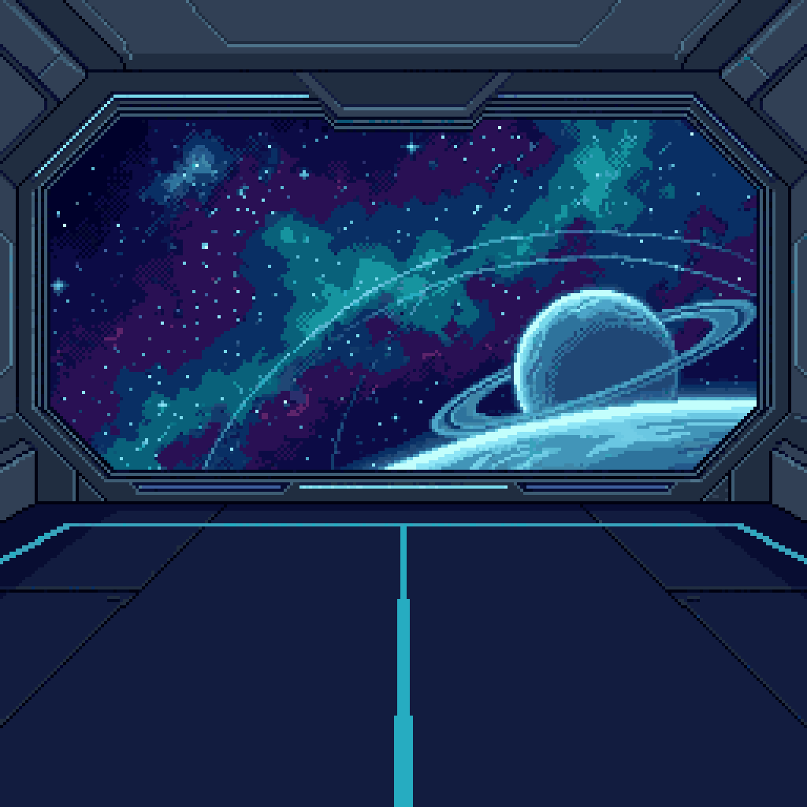
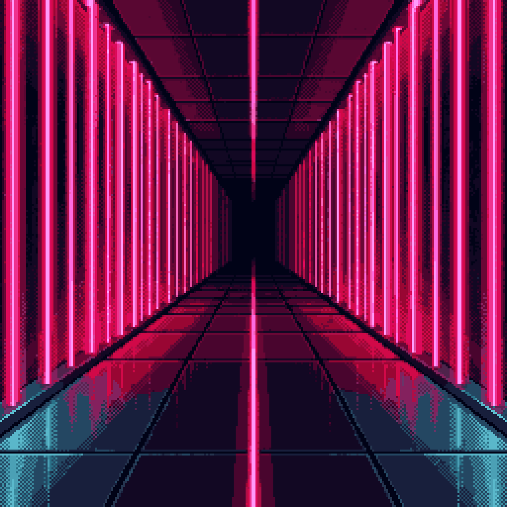

# Arenas

> **Drei Schauplätze — Prinzip, Übersicht und Regeln.**
>
> Enthält: Arena-Prinzip, Übersicht und alle drei MVP-Arenen. *(Original-PRD: §16)*

---

## 5.1 Arena-Prinzip

Der MVP enthält drei Arenen.

Die Arenen unterscheiden sich visuell, aber nicht mechanisch.

## 5.2 Übersicht

| Nr. | Arena | Funktion |
|---:|---|---|
| 1 | Neon Grid Court | Standardarena |
| 2 | Orbital Arcade Deck | Sci-Fi-Variante |
| 3 | Laser Alley | intensive Finalarena |

## 5.3 Neon Grid Court

Klassische 80er-Arcade-Arena mit dunklem Hintergrund, Neonraster, klarer Mittellinie und sehr guter Lesbarkeit.

  

Verwendung:

1. Free Match.
2. Runde 1 im Mini-Turnier.
3. Standardarena für frühe Spieltests.

## 5.4 Orbital Arcade Deck

Raumstationsarena mit Blick auf Sterne, Orbit-Linien oder einen fernen Planetenring.

  

Verwendung:

1. Free Match.
2. Runde 2 im Mini-Turnier.
3. Sci-Fi-Atmosphäre ohne visuelle Überladung.

## 5.5 Laser Alley

Dunklere, intensivere Arena mit Laserlinien, hohem Kontrast und stärkerem Finalgefühl.

  

Verwendung:

1. Free Match.
2. Finalmatch im Mini-Turnier.
3. Visuell stärkster Arena-Eindruck im MVP.

## 5.6 Arena-Regeln

1. Keine Hindernisse im MVP.
2. Keine Arena-spezifischen Spezialeffekte im MVP.
3. Keine veränderte Ballphysik je Arena.
4. Keine Sichtbehinderung durch Hintergründe.
5. Ball, Paddles und Score müssen immer klar erkennbar bleiben.
6. Arenen liefern Atmosphäre, aber keine mechanische Veränderung.

---

← [Zurück zum README](../README.md) · Vorher: [04-characters.md](04-characters.md) · Weiter: [06-art-and-audio.md](06-art-and-audio.md) · Visuals: [Asset Gallery](asset-gallery.md)
