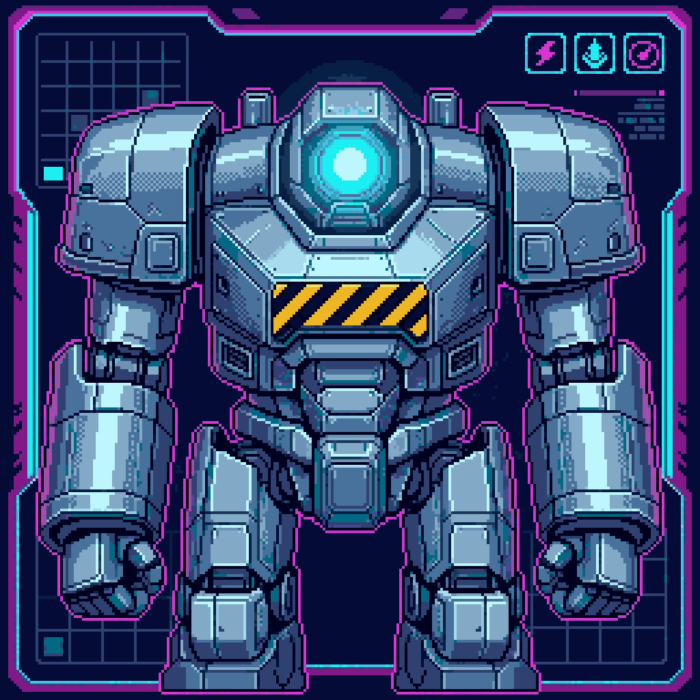
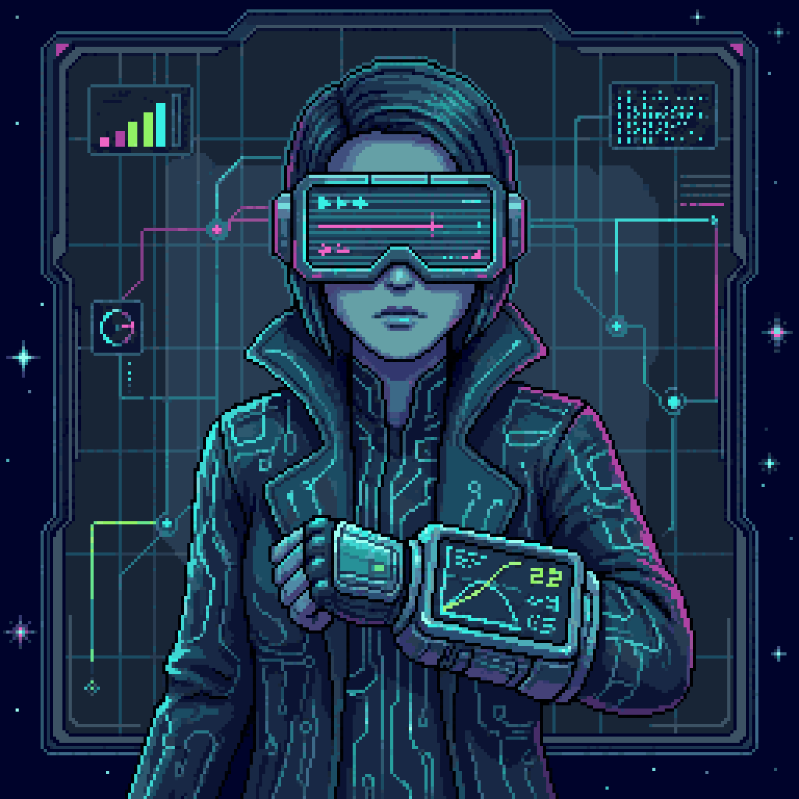
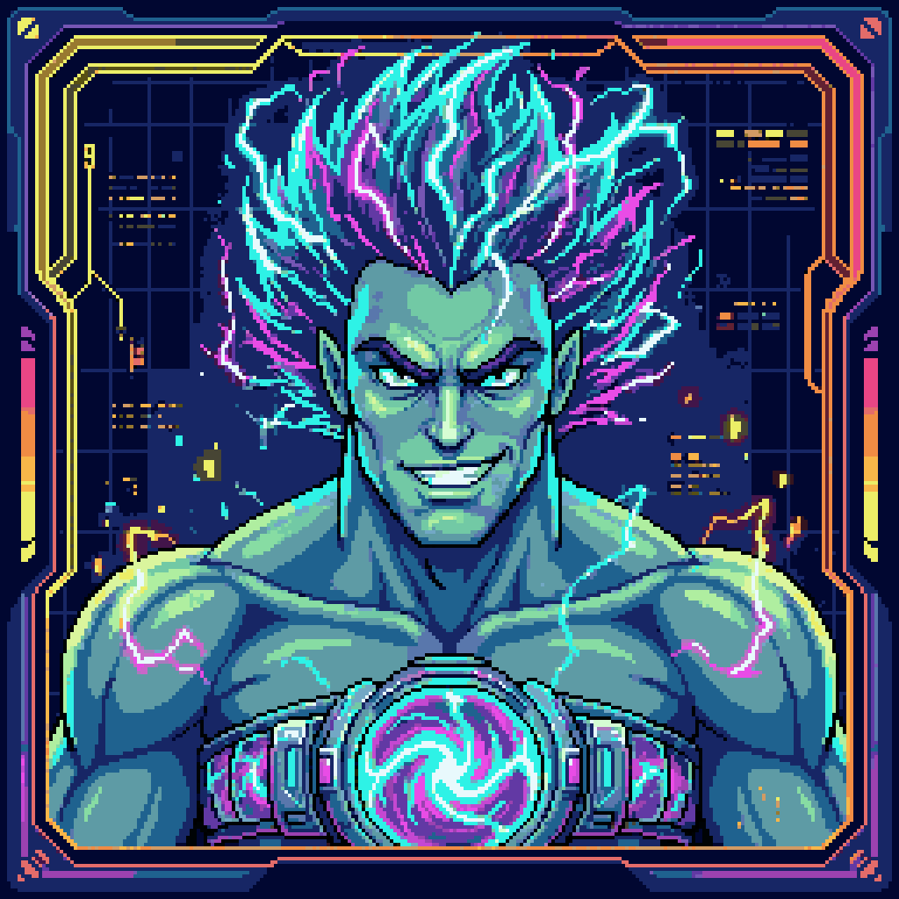
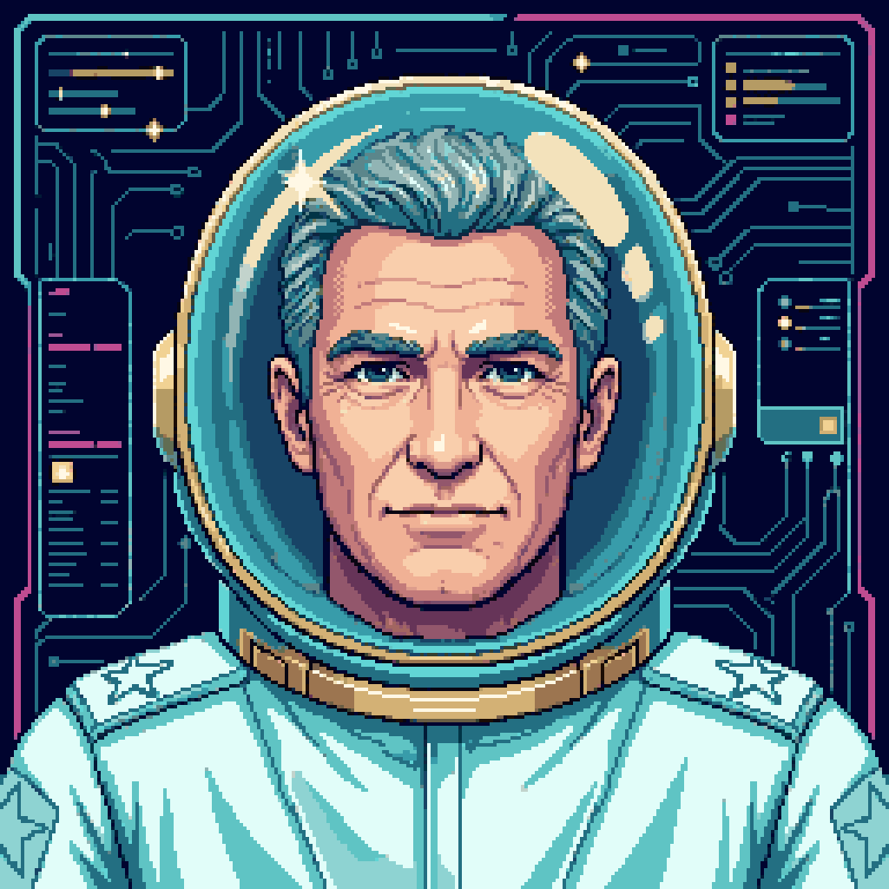
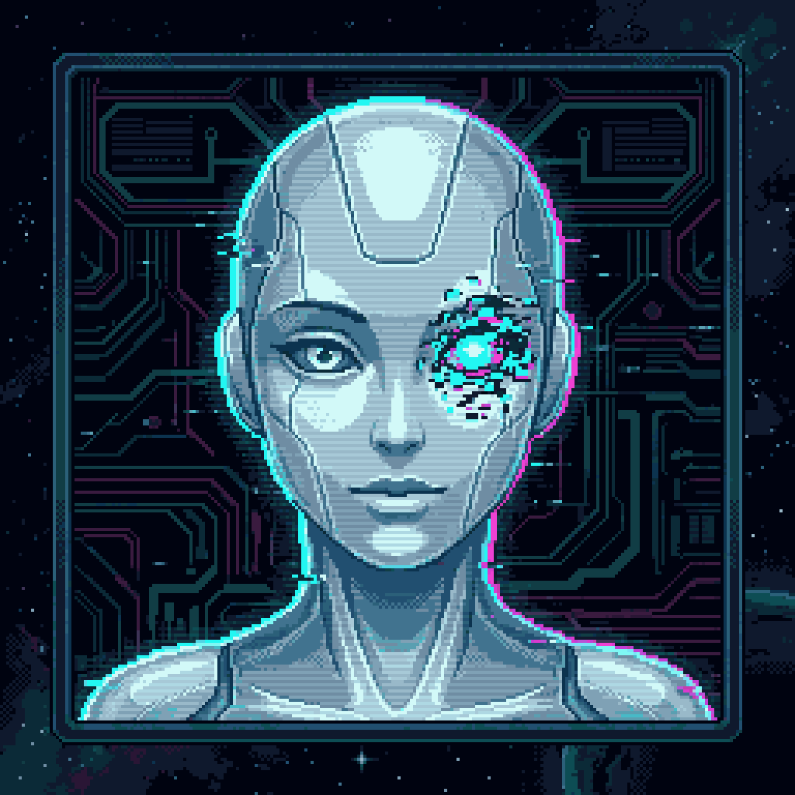
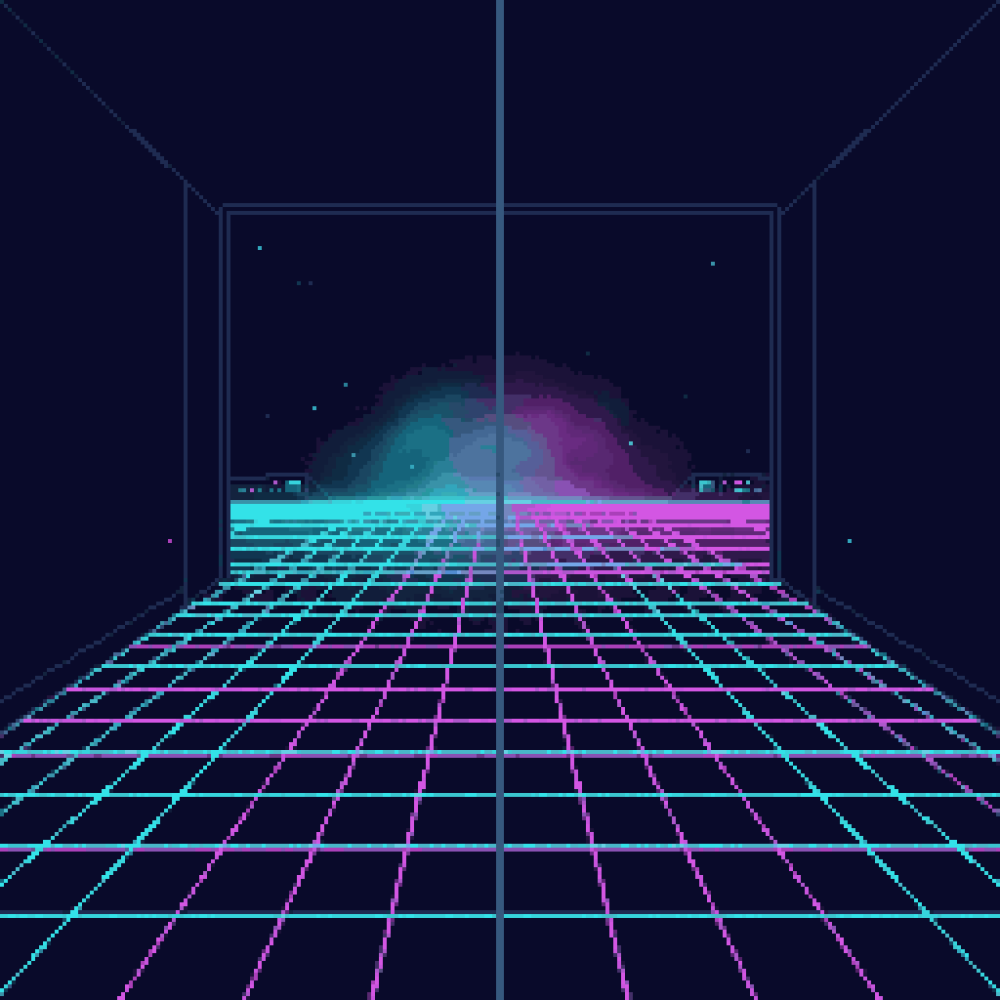

# Asset Gallery

> **Visuelle Übersicht aller produzierten Assets.** Wer den Repo besucht und sehen will, wie das Spiel aussieht, landet hier.

Für den vollständigen Audit-Trail (Prompts, Parameter, Kosten, Iterationen) siehe [asset-history.md](asset-history.md).

---

## Hero / Startscreen

  

**Status:** Final · 2026-04-28
**Source:** AI-generated (`rd_pro__scifi`, 256×256), nearest-neighbor upscaled to 1024×1024, title and subtitle composited via [Press Start 2P](https://fonts.google.com/specimen/Press+Start+2P).

---

## Characters

### Nova Vex — Speedster (Neon Sector 7)

> Former test pilot for experimental light drives. Wins through speed, timing, and last-second saves, never through force.

  

**Status:** Final · 2026-04-28 · User-Pick: Variante 01 (Tournament Roster Card mit Visor-HUD-Reflexion und kreisrundem Brust-Emblem). Alternative Variante 02 archiviert in `assets/archive/characters/`.

### Brakk-9 — Defender (Outer Ring of the Titan Shipyards)

> Built to seal space dock gates against meteor strikes. In the Circuit, he does the same thing: he stands in the way. Not elegant. Not fast. Very hard to pass.

  

**Status:** Final · 2026-04-28 · User-Pick: Variante 02 (Roster-Card mit HUD-Stat-Icons oben rechts und Grid-Pattern-Hintergrund). Alternative Variante 01 (full-body Defender-Poster mit octagonal Frame) archiviert in `assets/archive/characters/`.

### Lyra Byte — Technician (Data Moon L-404)

> Reads ball trajectories like old machine code. Her matches look less like sport and more like debugging under neon light. She wins by making opponents stand in exactly the wrong place.

  

**Status:** Final · 2026-04-28 · User-Pick: Variante 01 (Hooded figure, Scan-Line-Visor mit Trajectory-Arrows, Wrist-Terminal mit Vektor-Diagramm). Alternative Variante 02 (Matrix-Visor, Code-Terminal-Hintergrund) archiviert in `assets/archive/characters/`.

### Rexx Volt — Striker (Plasma Colony Voltara Prime)

> Does not play to score. He plays to make impacts. His fans call him the Plasma Hammer. His opponents usually say nothing, because they are busy chasing the ball.

  

**Status:** Final · 2026-04-28 · User-Pick: Variante 01 (Green alien skin, Plasma-Vortex-Gürtel, wild electric hair, gold frame mit Voltara-Accents). Alternative Variante 02 archiviert in `assets/archive/characters/`.

### Captain Sol — Balanced Pilot (Sol Federation Training Fleet)

> The last representative of the old Arcade Fleet. No tricks. No plasma drama. No corrupted data magic. Just clean positioning and a very long patience bar.

  

**Status:** Final · 2026-04-28 · User-Pick: Variante 02 (Goldfish-Bowl-Helm mit goldenem Randring, silbergraues Haar, ruhiges Halblächeln, HUD-Panels). Alternative Variante 01 (versiegelter Bubble-Helm, ernst) archiviert in `assets/archive/characters/`.

### Glitch-Ø — Chaos Unit (Unknown Memory Sector)

> Nobody invited Glitch-Ø. The unit simply appeared in the tournament bracket, complete with its own statistics, corrupted victory music, and a paddle that occasionally looks like it is having a bad day. Somehow, it still wins more often than it should.

  

**Status:** Final · 2026-04-28 · User-Pick: Variante 02 (Android-Gesicht mit mechanischen Nähten, normales linkes Auge, Cyan-Pixel-Disintegration rechtes Auge, fragmentierte Kanten). Alternative Variante 01 (Ghost-Hologram, plasma-explosion eye) archiviert in `assets/archive/characters/`.

---

## Arenas

### Neon Grid Court

> Klassische 80er-Arcade-Standardarena. Dunkler Hintergrund, Neon-Raster, klare Mittellinie. Free Match + Runde 1 im Mini-Turnier.

  

**Status:** Final · 2026-04-28 · User-Pick: Variante 02 (Framed Coliseum mit Nebula-Horizon und klarer zentraler Mittellinie). Alternative Variante 01 archiviert in `assets/archive/arenas/`.

### Orbital Arcade Deck

`<noch nicht generiert>`

### Laser Alley

`<noch nicht generiert>`

---

## Branding / Marketing

### Social Preview

  

**Status:** Final · 2026-04-28 · Format: 1280×640 (GitHub-Repo-Card-Standard)
**Upload nach:** GitHub Settings → Social preview → upload `assets/social-preview.png`

---

## Asset-Stand auf einen Blick

| Asset-Kategorie | Soll (MVP) | Ist | Coverage |
|---|---|---|---|
| Startscreen / Hero | 1 | 1 ✅ | 100% |
| Charaktere | 6 | 6 ✅ (Nova Vex, Brakk-9, Lyra Byte, Rexx Volt, Captain Sol, Glitch-Ø) | 100% |
| Arenen | 3 | 1 ✅ (Neon Grid Court) | 33% |
| Ball-Skins | 5 | 0 | 0% |
| UI-Elements | mehrere | 0 | 0% |
| Audio | mehrere | 0 | 0% |
| **Branding** | | | |
| Social Preview | 1 | 1 ✅ | 100% |

Vollständige Asset-Liste pro PRD §21 ([06-art-and-audio.md](06-art-and-audio.md)).

---

← [Zurück zum README](../README.md) · Audit-Trail: [asset-history.md](asset-history.md)
