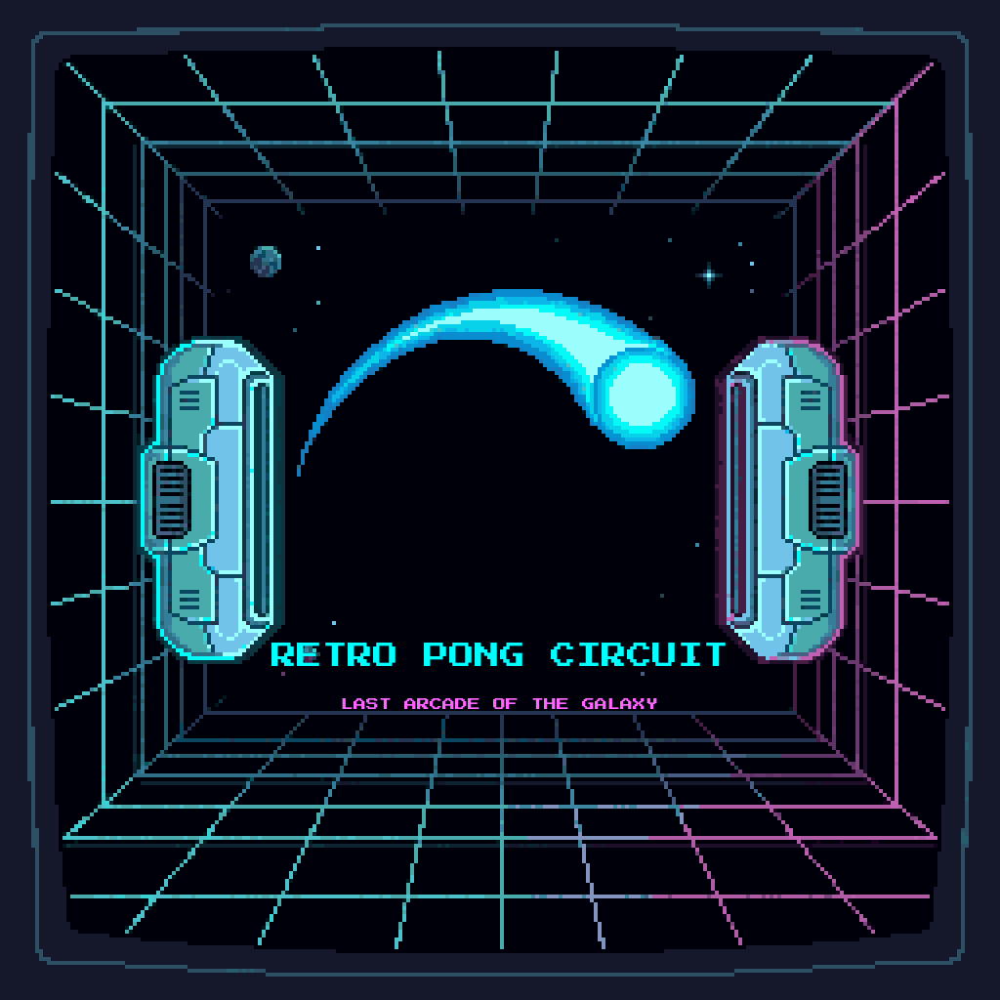
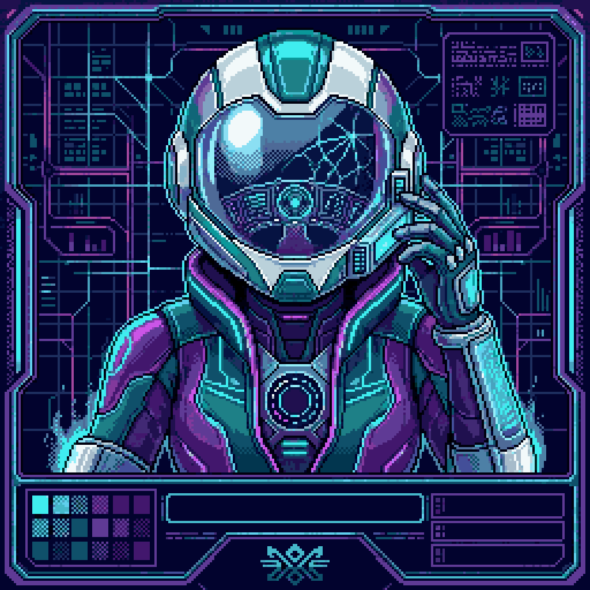
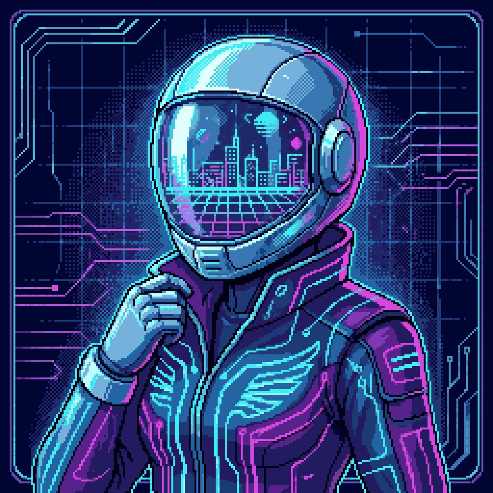
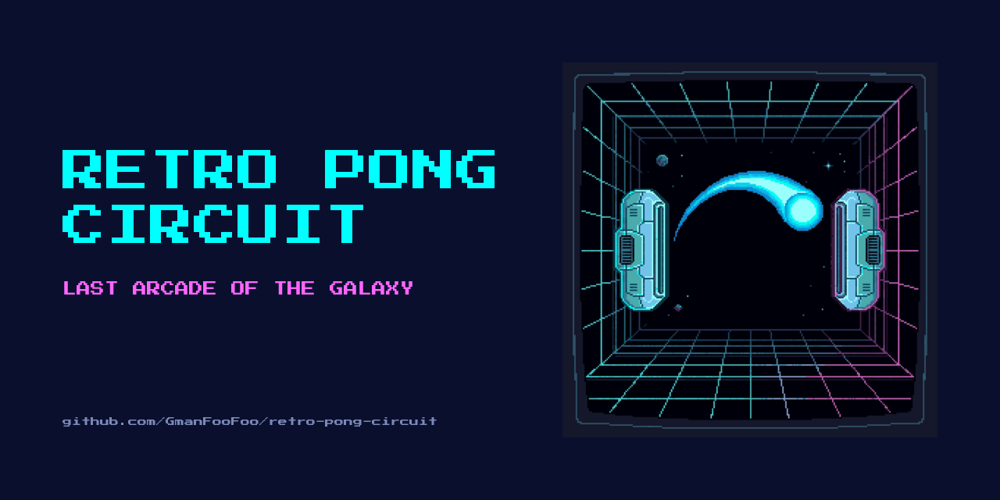

# Asset Gallery

> **Visuelle Übersicht aller produzierten Assets.** Wer den Repo besucht und sehen will, wie das Spiel aussieht, landet hier.

Für den vollständigen Audit-Trail (Prompts, Parameter, Kosten, Iterationen) siehe [asset-history.md](asset-history.md).

---

## Hero / Startscreen

  

**Status:** Final · 2026-04-28
**Source:** AI-generated (`rd_pro__scifi`, 256×256), nearest-neighbor upscaled to 1024×1024, title and subtitle composited via [Press Start 2P](https://fonts.google.com/specimen/Press+Start+2P).

---

## Characters

### Nova Vex — Speedster (Neon Sector 7)

> Former test pilot for experimental light drives. Wins through speed, timing, and last-second saves, never through force.

**Beide Varianten zur Auswahl** — eine wird Hero, die andere wandert nach `assets/archive/`.

<table>
  <tr>
    <td align="center" width="50%">
      <strong>Variante 01</strong> 
      <em>Tournament Roster Card mit eingebautem UI-Frame</em>  
      
    </td>
    <td align="center" width="50%">
      <strong>Variante 02</strong> 
      <em>Cleaner Charakter-Poster mit Cityscape-im-Visor</em>  
      
    </td>
  </tr>
</table>

**MASCHIN-Empfehlung: Variante 02** — Cityscape-im-Visor erzählt die Neon-Sector-Lore, Flügel-Emblem stärkt Speedster-Identität, cleane Komposition lässt uns später ein konsistentes Card-Frame für alle 6 Charaktere bauen.

**Status:** Wahl offen · Stil-Konsistenz mit Hero (gleicher RD_PRO scifi style)

### Brakk-9 — Defender

`<noch nicht generiert>`

### Lyra Byte

`<noch nicht generiert>`

### Rexx Volt

`<noch nicht generiert>`

### Captain Sol

`<noch nicht generiert>`

### Glitch-Ø

`<noch nicht generiert>`

---

## Arenas

### Neon Grid Court

`<noch nicht generiert>`

### Orbital Arcade Deck

`<noch nicht generiert>`

### Laser Alley

`<noch nicht generiert>`

---

## Branding / Marketing

### Social Preview

  

**Status:** Final · 2026-04-28 · Format: 1280×640 (GitHub-Repo-Card-Standard)
**Upload nach:** GitHub Settings → Social preview → upload `assets/social-preview.png`

---

## Asset-Stand auf einen Blick

| Asset-Kategorie | Soll (MVP) | Ist | Coverage |
|---|---|---|---|
| Startscreen / Hero | 1 | 1 ✅ | 100% |
| Charaktere | 6 | 0–1 (Auswahl ausstehend) | 0–17% |
| Arenen | 3 | 0 | 0% |
| Ball-Skins | 5 | 0 | 0% |
| UI-Elements | mehrere | 0 | 0% |
| Audio | mehrere | 0 | 0% |
| **Branding** | | | |
| Social Preview | 1 | 1 ✅ | 100% |

Vollständige Asset-Liste pro PRD §21 ([05-art-and-audio.md](05-art-and-audio.md)).

---

← [Zurück zum README](../README.md) · Audit-Trail: [asset-history.md](asset-history.md)
